# YourChef

​	We built a web food ordering application for targeted customers who need special instructions on the dishes to better suite their personal taste. The criteria include saltiness, sourness, sweetness, etc.  The targeted restaurant user should be willing to provide this kind of service to improve the customer satisfaction. 

​	The customer will sign up and make a quick profile about their general taste. The system will send their order to a restaurant in real time and is able to store their previous orders. The system will match very similar-taste restaurant and pop-up their customizations on dishes as suggestions. The database contains a number of supporting restaurants that could make customized dishes and some dishes information. 

​	The restaurant side is able to add/remove dishes and modify dish prices, provide some taste and ingredient information. After they get the order, they will print the order and the customization to give to the chief. With that feedback and easiness of customization, customers get more satisfaction and restaurant can achieve better performance.

## Install Requirement Packages: 

(Python Version: 3.6)

pip install -r requirements.txt
## Build:
Our application builds through Travis CI.

## Operate:
1. Download the repository 
2. Add the project path to python’s work directory
```
cd (PATH of our Project in your computer)
export PYTHONPATH="$PYTHONPATH:(PATH of our Project in your computer)"
```
3. Run the application in terminal
```
python YourChef/application.py
```
4. In your browser, go to the port that the application is running on

```
Running on http://127.0.0.1:5000/ (Press CTRL+C to quit)
```

### User

1. User Register

   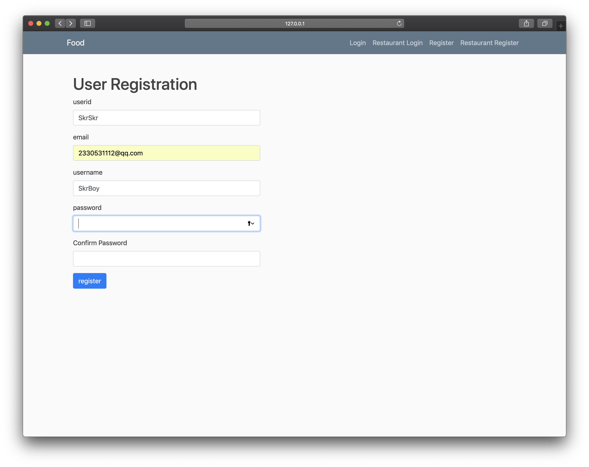

2. User Log in

   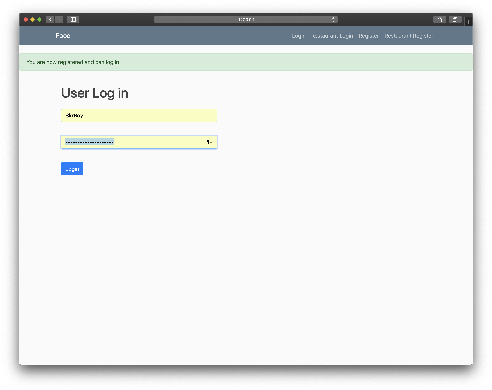

3. Log out

   Click the Logout button to log out

4. Modify Profile

   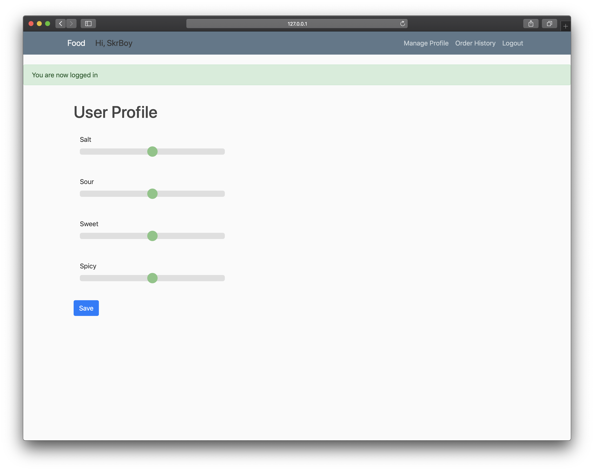

5. Restaurant List

   After log in you will see this page, click any restaurant to see their offers.

   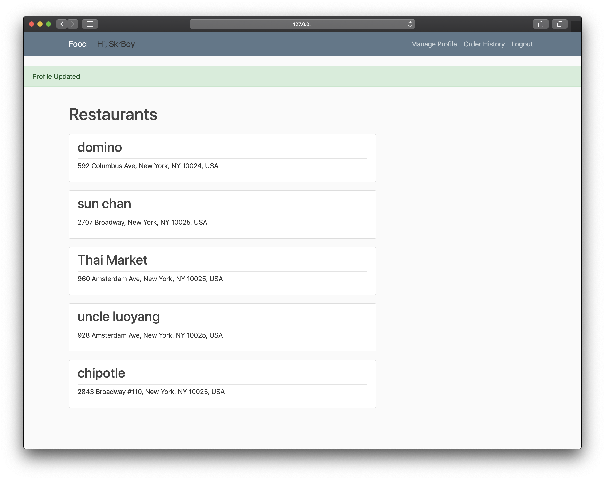

6. User shopping cart

   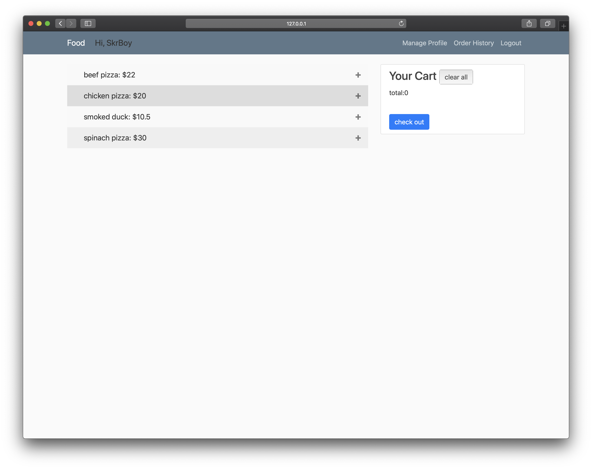

7. User Order History

   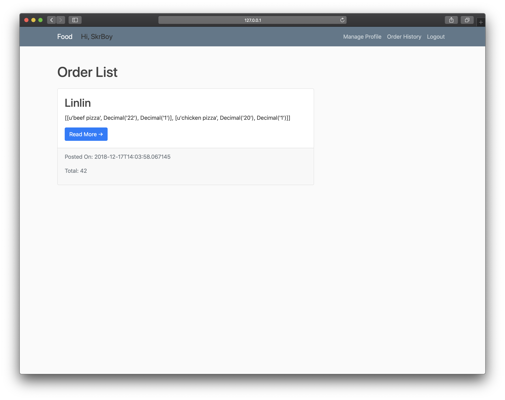

8. Restaurant Dish Management

### Restaurant

1. Restaurant Registration

   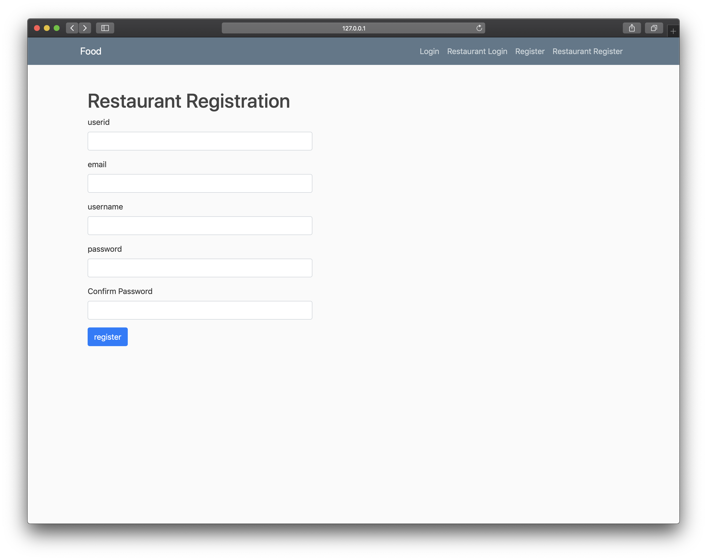

2. Restaurant auto-fill address

   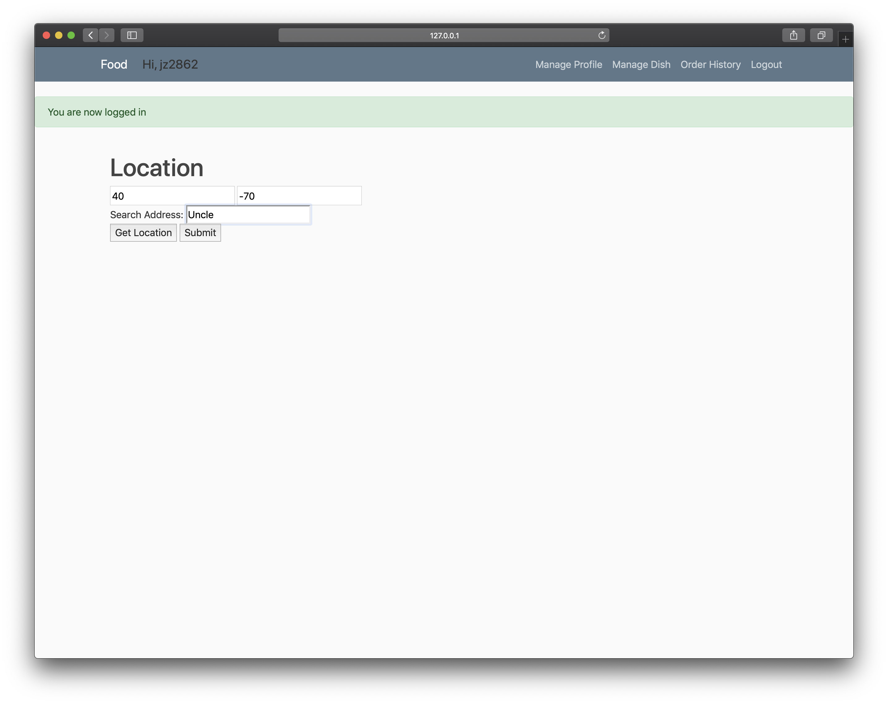

3. Restaurant Login

   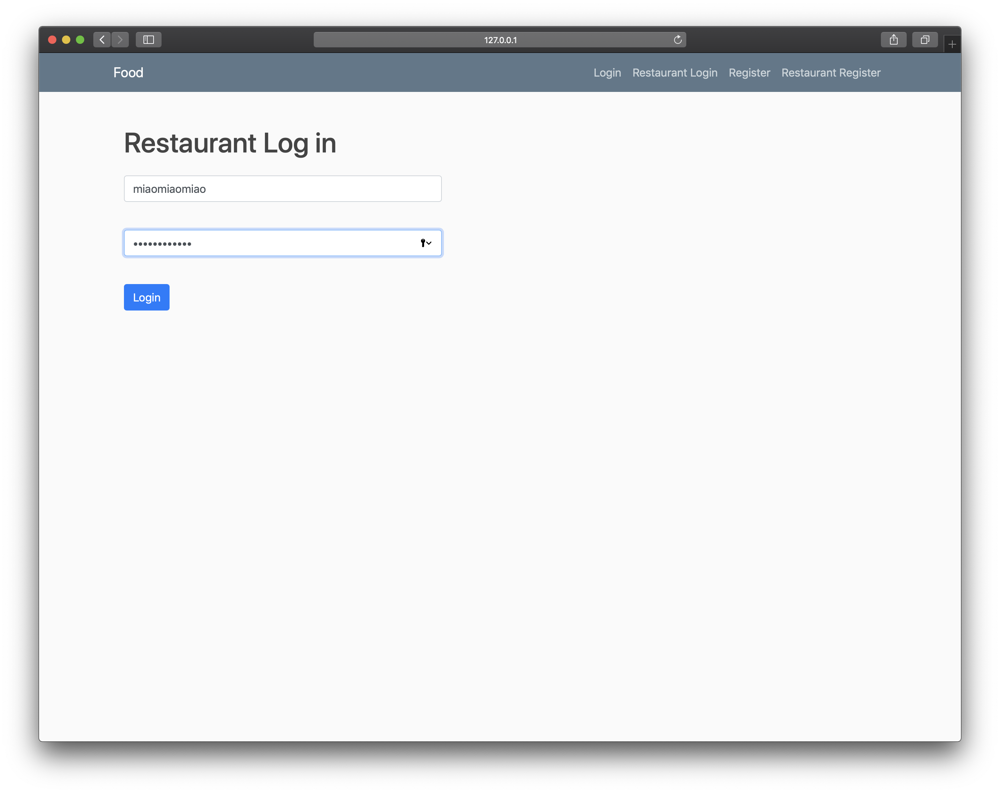

4. Restaurant Logout

   Click logout button to log out.

5. Restaurant Manage Dish

   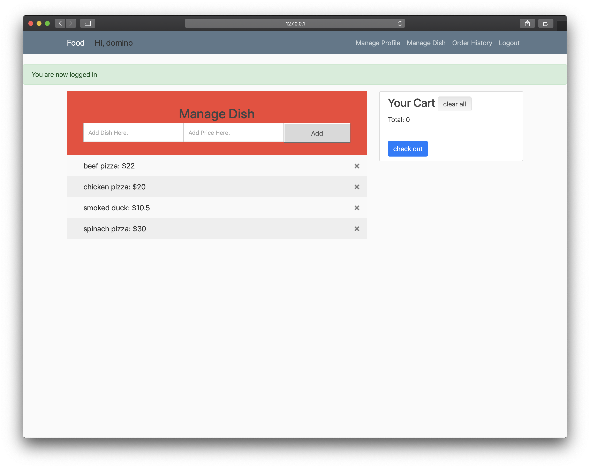

6. Restaurant Modify Taste Profile

   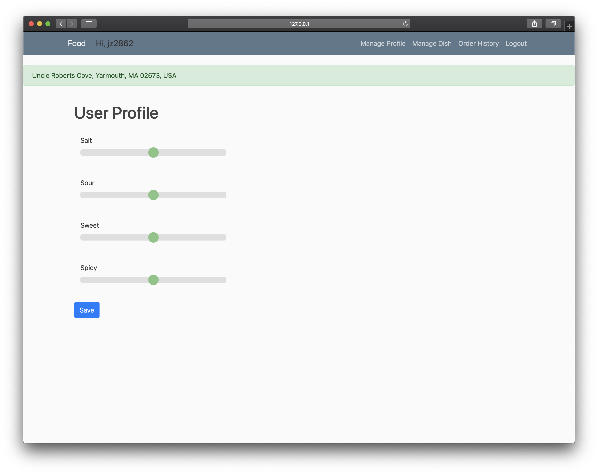

7. Restaurant check order list

   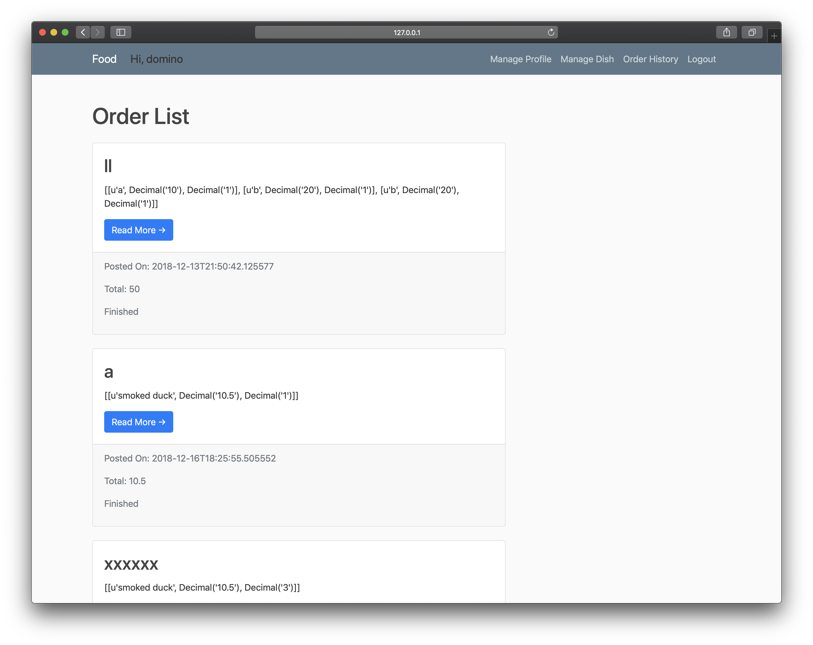

## Test:

The unit test and coverage test can be done by rebuilding the project in the Travis-CI.

The relating post-commit scripts are listed as follows:

```
  - pytest Test/TestUser.py
  - pytest Test/TestRegistration.py
  - pytest Test/TestMenu.py
  - pytest Test/TestUser.py > report/user_test.txt
  - pytest Test/TestRegistration.py > report/registration_test.txt
  - pytest Test/TestMenu.py > report/menu_test.txt
  - coverage run --source=YourChef.userHelper Test/TestUser.py
  - coverage report -m
  - coverage report > report/user_coverage.txt
  - coverage run --source=YourChef.registration Test/TestRegistration.py
  - coverage report -m
  - coverage report > report/registration_coverage.txt
  - coverage run --source=YourChef.gmHelper Test/TestGM.py
  - coverage report -m
  - coverage report > report/gm_coverage.txt
  - coverage run --source=YourChef.menu Test/TestMenu.py
  - coverage report -m
  - coverage report > report/menu_coverage.txt
```

## Pre-Commit

cp pre-commit .git/hooks/

cd .git/hooks/

chmod +x pre-commit

